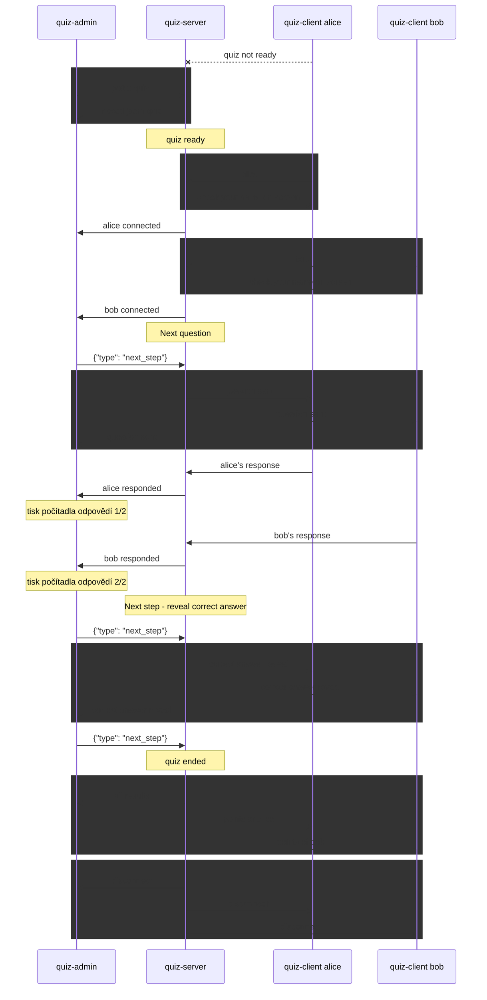

```mermaid
sequenceDiagram
    participant quiz-admin
    participant quiz-server
    participant quiz-client alice
    participant quiz-client bob

    quiz-client alice --x quiz-server: quiz not ready
    rect
        quiz-admin ->> quiz-server: pošle quiz
        quiz-server ->> quiz-admin: načetl jsem quiz
    end
    
    Note over quiz-server: quiz ready

    rect
        quiz-client alice ->> quiz-server: alice
        quiz-server ->> quiz-client alice: check your name on screen
    end
    quiz-server ->> quiz-admin: alice connected

    rect
        quiz-client bob ->> quiz-server: bob
        quiz-server ->> quiz-client bob: check your name on screen
    end
    quiz-server ->> quiz-admin: bob connected

    Note over quiz-server: Next question

    quiz-admin ->> quiz-server: {"type": "next_step"}
    rect
        quiz-server ->> quiz-client alice: question sent
        quiz-server ->> quiz-client bob: question sent
        quiz-server ->> quiz-admin: question sent
    end

    quiz-client alice ->> quiz-server: alice's response
    quiz-server ->> quiz-admin: alice responded
    Note over quiz-admin: tisk počítadla odpovědí 1/2

    quiz-client bob ->> quiz-server: bob's response
    quiz-server ->> quiz-admin: bob responded
    Note over quiz-admin: tisk počítadla odpovědí 2/2

    Note over quiz-server: Next step - reveal correct answer
    quiz-admin ->> quiz-server: {"type": "next_step"}

    rect
        quiz-server ->> quiz-client alice: correct answer reveal
        quiz-server ->> quiz-client bob: correct answer reveal
        quiz-server ->> quiz-admin: correct answer reveal
    end

    quiz-admin ->> quiz-server: {"type": "next_step"}

    Note over quiz-server: quiz ended

    rect
        quiz-server ->> quiz-admin: all results
        quiz-server ->> quiz-client alice: points of alice
        quiz-server ->> quiz-client bob: points of bob
    end

    rect
        quiz-server ->> quiz-admin: disconnect
        quiz-server ->> quiz-client alice: disconnect
        quiz-server ->> quiz-client bob: disconnect
    end
```
